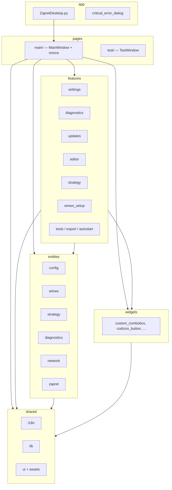

# Архитектура FSD — ZapretDesktop

Документ описывает структуру исходников после перехода на Feature-Sliced Design (июнь 2026).

## Диаграмма слоёв



## Карта модулей (бывший → новый путь)

### shared

| Модуль | Путь |
|--------|------|
| translator | `shared/i18n/translator.py` |
| path_utils, version_utils, text_encoding, github_utils, app_logging | `shared/lib/` |
| theme, standard_window, standard_dialog, message_box_utils, system_tray, update_progress, window_styles | `shared/ui/` |
| embedded_assets, embedded_style, codicons_manager, codicon_utils | `shared/ui/assets/` |

### entities

| Модуль | Путь |
|--------|------|
| config_manager | `entities/config/config_manager.py` |
| winws_manager, winws_version | `entities/winws/` |
| bat_generator | `entities/strategy/bat_generator.py` |
| diagnostics_runner, diagnostics_config | `entities/diagnostics/` |
| network_status | `entities/network/network_status.py` |
| domain_variants | `entities/domain/domain_variants.py` |
| zapret_updater | `entities/zapret/zapret_updater.py` |

### features

| Сценарий | Путь |
|----------|------|
| Настройки | `features/settings/ui/settings_dialog.py` |
| Диагностика | `features/diagnostics/ui/diagnostics_dialog.py` |
| Обновления, дополнения | `features/updates/` |
| Первичная настройка winws | `features/winws_setup/ui/` |
| Редактор файлов | `features/editor/ui/` + `features/editor/lib/` |
| Конструктор стратегий | `features/strategy/ui/strategy_creator_window.py` |
| Bin creator | `features/tools/ui/bin_creator_dialog.py` |
| Экспорт bundle | `features/export/` |
| Автозапуск | `features/autostart/autostart_manager.py` |

### pages

| Экран | Путь |
|-------|------|
| MainWindow | `pages/main/window.py` |
| Workers (start/stop) | `pages/main/workers.py` |
| Mixins (13 шт.) | `pages/main/mixins/` |
| TestWindow | `pages/test/test_window.py` |

## Mixins ↔ features

Mixins в `pages/main/mixins/` — **композиционный слой** главного окна. Каждый mixin связывает UI страницы с feature/entity:

| Mixin | Feature / Entity |
|-------|------------------|
| lifecycle_mixin | autostart, tray, winws watcher |
| strategy_run_mixin | winws_manager, workers |
| strategy_list_mixin | winws paths, strategies |
| updates_mixin | updates, winws_setup, addons |
| settings_mixin | settings |
| tools_mixin | editor, test, bin_creator, strategy_creator |
| diagnostics_mixin | diagnostics |
| filters_mixin | winws lists |
| strategy_flags_mixin | bat_generator |
| network_mixin | network_status |
| version_mixin | winws_version, zapret_updater |

## Добавление нового функционала

1. **Доменная логика** → `entities/<domain>/`
2. **UI сценарий** → `features/<feature>/ui/` (+ `lib/` для внутренних хелперов)
3. **Подключение к главному окну** → новый mixin или расширение существующего в `pages/main/mixins/`
4. **Переиспользуемый контрол** → `widgets/`
5. Обновить README соответствующей папки

## Скрипты разработки

| Скрипт | Назначение |
|--------|------------|
| `scripts/download_codicons.py` | Установка codicons в AppData |
| `scripts/migrate_fsd.py` | Одноразовая миграция (исторический) |
| `scripts/split_main_window.py` | Извлечение mixins из монолита |
| `scripts/main_window_source.py` | **ARCHIVED** — монолит до FSD; `__main__` завершается с ошибкой |

## Документация

- [docs/README.md](../../docs/README.md) — индекс
- [docs/DEVELOPMENT.md](../../docs/DEVELOPMENT.md) — разработка и тесты

## Известные нарушения FSD (допустимые)

- `shared/ui/assets/embedded_style.py` обращается к `theme` (shared → shared, OK)
- `pages/main/mixins` импортирует несколько features — это роль composition root
- `widgets` импортируют `theme` и `translator` — типично для design system

## Тестирование после изменений

```bash
python -m pytest tests/ -v
python -c "from src.pages.main import MainWindow; print('OK')"
```

Ручной smoke-test: [SMOKE_CHECKLIST.md](SMOKE_CHECKLIST.md).
